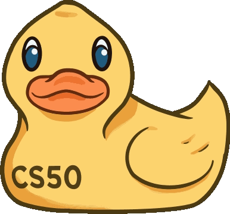

# CS50 2025 - Harvard - Topics Summary

This repository contains the code and summaries of the lessons attended in the CS50 2025 course from Harvard University. Each topic covered throughout the course is documented with the corresponding code and a brief explanation of the concepts discussed. The aim is to provide an overview of the topics learned and showcase practical examples of implementation.

The files are organized by topic, making it easier to navigate and study the key computer science concepts, such as algorithms, data structures, Python programming, software engineering, and more. Access the topics to view the full code and detailed explanations of each subject.

   | Topics:          |                               
   |------------------|
   |[Topic 1: C](./Week%201.c) |
   |[Topic 2: Arrays](./Week%202.arrays) |
   |[Topic 3: Algorithms](./Week%203.algorithms) |
   |[Topic 4: Memory](./Week%204.memory) |
   |[Topic 5: Data Structures](./Week%205.data-structures) |
   |[Topic 6: Python](./Week%206.data-structures) |
   |[Topic 7: SQL](./Week%207.sql) |
   |[Topic 8: Web (HTML/CSS/JavaScript)](./Week%208.web) |
   |[Topic 9: Flask Framework](./Week%209.flask) |

