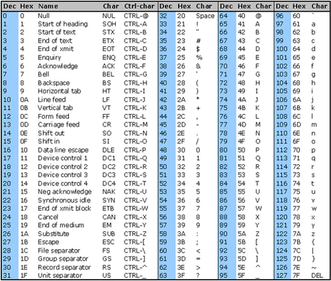

# Week 1 - Introduction to Computer Science - CS50

> Computers only understand zeros and ones — the binary system — which means two possible states.

A **bit** stands for **binary digit**.  
Inside all electronic devices, there are countless tiny "light switches" called **transistors**, which can be either **on** or **off**. This is how information is stored.

The more bits we use, the more information we can store.  
A standard was created for organization:

- **1 byte = 8 bits**
- With 8 bits, we can represent values from **0 to 255** (256 possibilities).

---

## How Computers Represent Letters with Bits

To represent text, the **ASCII** pattern was created, where each number corresponds to a letter.

> 🛑 ASCII only covers the English alphabet.

For languages with more characters, **UNICODE** was developed — a standard that supports virtually all languages.


---

## Representing Colors with Bytes

Colors are represented using **RGB notation**, consisting of **three bytes**:

- **R (Red)** 
- **G (Green)**
- **B (Blue)**

Each byte defines the intensity of the corresponding color.  
Example:

```text
R: 73, G: 75, B: 33 → A shade of yellow
```

The Role of Software
When we write software, we translate bits into meaningful actions:

```text
Input → Software (Algorithm) → Output
```

An algorithm is a set of steps to solve a problem.
Some algorithms can be slow — and finding better implementations can make a huge difference in performance.

**Summary**
Computers use binary to represent information.

Bytes group bits for better organization.

ASCII and UNICODE allow representing text.

RGB uses bytes to define colors.

Software bridges input, processing, and output through algorithms.

## Compiler

A **compiler** converts source code into machine code — instructions that the computer can execute.

When you run **Clang** (a compiler), it goes through four phases:

1. **Preprocessing**  
   Directives like `#include` cause the contents of a header file to be copied into the source file.  
   Example:  
   Using `#include <stdio.h>` and calling `printf`, the preprocessor copies the function prototype from `stdio.h`.

2. **Compiling**  
   Translates C code into **assembly language**, a low-level language understandable by the processor.

3. **Assembling**  
   Converts assembly code into **machine code** (binary instructions).

4. **Linking**  
   Combines all necessary files, like `.c` source files and precompiled libraries, into a single executable.  
   Resolves function references and ensures the actual implementations are included.

---

## Reverse Engineering

- **Decompilation**  
  Converts machine code back into high-level code, but the result may differ from the original (due to optimizations and loss of variable names/comments).

- **Disassembly**  
  Converts machine code into **assembly language** — easier to analyze but still low-level.

> 🔍 Full reconstruction of the original source code is generally **not possible**.

---

## Debugging

The best way to fix broken programs is **not** using `printf`, but using a **debugger**.

- In CS50, `debug50` automates debugging.
- You must set **breakpoints** in your code.
- Always **initialize** numeric variables (e.g., `{0}`) to avoid **garbage memory** and unpredictable values.

---


