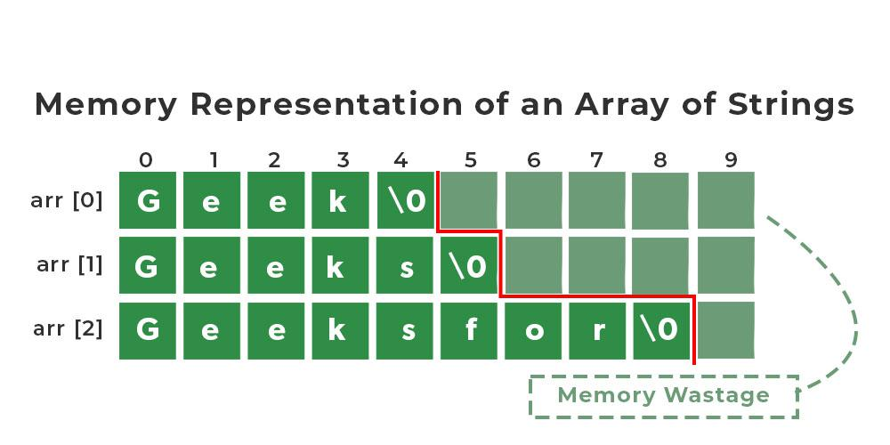

# Week 2 - Arrays - CS50


## Arrays

- An **array** is a sequence of contiguous memory locations that store elements of the same data type.
- A **string** is an array of `char`.
- A **2D array** of strings is like a **matrix** (e.g., 2×2).

In `printf`, characters are printed sequentially until reaching the **null terminator** (`\0`), which has the ASCII value **zero**.



---

## Command-Line Arguments

Programs can receive arguments from the command line:

```c
int main(int argc, string argv[]);
```

argc (argument count) → Number of command-line arguments.

argv[] (argument vector) → Array of strings containing the arguments.

📌 argv[0] is always the program's name.
