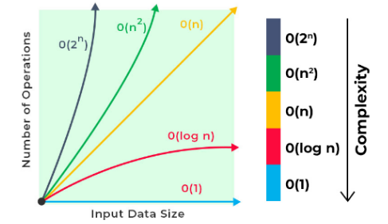

# Week 3 - Algorithms - CS50

An algorithm is a sequence of actions designed to solve problems efficiently, even as the problem size grows.

Linear Search
Sequential search through elements.

Binary Search
Picks the middle element, compares it, and decides whether to search the left or right half.
Requires a sorted list!

Big O Notation
Big O describes the upper bound of an algorithm’s complexity:

Complexity	Example
O(1)	Constant time
O(log n)	Binary Search
O(n)	Linear Search
O(n log n)	Efficient sorting
O(n²)	Nested loops
Ω (Omega) → Lower bound.

Θ (Theta) → Tight bound (upper and lower are the same).

📈 Execution time increases with input size according to these patterns.

String Comparison and Use Case
Use strcmp (from <string.h>) to compare strings.

Example:

Initially, two separate arrays (names and phone numbers) were used.

Arrays had to stay aligned, which was fragile and error-prone.

Solution: Structs were introduced to store related data together more effectively.

# Data Structures & Sorting Algorithms

## Data Structures

A **data structure** is a container for various kinds of data (custom data types).  
It allows for **data encapsulation**, grouping related information and operations into a structured format.  
For example, a **person** can be a data structure with attributes (like name, age) and associated functions (like `introduce()`).
**Data structures** are ways of organizing and storing data efficiently. They can be **linear** or **non-linear**, depending on how the elements are organized and accessed.

## Sorting Algorithms

Sorting algorithms are essential for organizing data efficiently. To determine the **Big O** notation of a sorting algorithm, its **mathematical formula** is analyzed, and the **dominant term** is used to define its complexity.

### Selection Sort

- **Description**:  
  Selection Sort divides the list into two parts: the sorted and unsorted sections.  
  In each iteration, it finds the smallest element in the unsorted section and swaps it with the first element of that section.  
  This process repeats until the entire list is sorted.

- **Time Complexity**: O(n²)  
  This makes it inefficient for large datasets.

---

### Bubble Sort

- **Description**:  
  Bubble Sort repeatedly swaps adjacent elements to sort the array.  
  It checks if adjacent elements are in the wrong order and swaps them.  
  The algorithm runs more efficiently if no swaps are made in a pass, which indicates that the array is already sorted.

- **Time Complexity**:  
  - **Worst Case**: O(n²)
  - **Best Case**: O(n) (when the array is already sorted or partially sorted).

---

## Recursion (Understanding Before Merge Sort)

**Recursion** is when a function calls itself to solve a problem by breaking it down into smaller instances until a **base case** is met.  
In a recursive program, execution follows a **stack-based approach**, meaning the remaining code is stored in the call stack and executed in reverse order once the base condition is reached.

---

## Merge Sort

**Merge Sort** is a **divide-and-conquer** algorithm that uses recursion and a binary tree structure to efficiently sort elements.  
It divides the dataset into smaller subarrays, sorts them, and then merges them back together in the correct order.

- **Time Complexity**: O(n log n)  
  This makes it an efficient algorithm for large datasets.
  
---

## Summary

- **Selection Sort**: O(n²) — inefficient for large datasets.
- **Bubble Sort**: O(n²) (worst case), O(n) (best case) — slightly more optimized with early exit.
- **Merge Sort**: O(n log n) — efficient, especially for large datasets.
- **Recursion**: Essential to understand for efficient algorithms like Merge Sort.