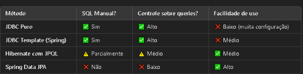

# 📚 Week 7: SQL

## 🧠 SQL Overview

Structured Query Language (SQL) é uma linguagem de programação usada para gerenciar e manipular bancos de dados relacionais.

### 🗂️ Tipos de Bancos de Dados

- **Flat-File Database**:
  - Utiliza um único arquivo de texto para armazenar dados.
  - O formato mais comum é CSV (Comma-Separated Values), que organiza dados em colunas e linhas.

- **Relational Database**:
  - Os dados são estruturados em tabelas com relacionamentos predefinidos.
  - SQL é usado para gerenciar e consultar bancos de dados relacionais.

### 🔄 Operações CRUD

SQL suporta quatro operações fundamentais, conhecidas como CRUD:

- **C** - Create (`INSERT`)
- **R** - Read (`SELECT`)
- **U** - Update (`UPDATE`)
- **D** - Delete (`DELETE`, `DROP`)

Os dados em bancos de dados SQL são armazenados em tabelas com linhas e colunas, semelhantes a planilhas, mas com funcionalidades mais robustas.

## 🛠️ Implementações de Banco de Dados SQL

Para este guia, utilizaremos o SQLite3, uma versão leve do SQL que permite armazenamento de dados localmente ou em bancos de dados baseados na nuvem.
Bancos de dados hospedados na nuvem, como PostgreSQL e MySQL, requerem tempo de atividade contínuo (24/7) e possuem pequenas variações em sintaxe e capacidades.

### 🆕 Criando um Novo Banco de Dados com SQLite3

```bash
sqlite3 database_name.db  # Exemplo: sqlite3 favorites.db
```

### ⚙️ Comandos Predefinidos do SQLite

- `.mode <mode>`: Define o modo de dados (ex: `.mode csv` para formato CSV).
- `.schema`: Exibe a estrutura do banco de dados, incluindo cabeçalhos de tabelas e tipos de dados.

### 🔍 Recuperando Dados de uma Tabela

```sql
SELECT columns FROM table;
SELECT * FROM favorites;
```

Ao usar `SELECT` em colunas específicas, é necessário alocar memória para o novo conjunto de dados.
SQL também fornece funções estatísticas integradas como `COUNT()`, `AVG()` e `SUM()` para realizar análises de dados.
Funcionalidades adicionais de filtragem e ordenação incluem `GROUP BY`, `LIKE` e `LIMIT`.
Condições booleanas também podem ser aplicadas usando os operadores `AND`, `OR` e `NOT`.

## 🧾 Comandos Comuns em SQL

| Comando                                       | Uso                                                                 |
|----------------------------------------------|----------------------------------------------------------------------|
| `CREATE DATABASE name;`                      | Cria um novo banco de dados                                          |
| `CREATE TABLE table_name (...);`             | Define uma nova tabela com colunas e tipos de dados especificados    |
| `INSERT INTO table_name VALUES (...);`       | Insere dados em uma tabela                                           |
| `SELECT column_names FROM table_name;`       | Recupera colunas específicas de uma tabela                           |
| `SELECT * FROM table_name;`                  | Recupera todos os dados de uma tabela                                |
| `UPDATE table_name SET column=value WHERE condition;` | Atualiza registros específicos                                 |
| `DELETE FROM table_name WHERE condition;`    | Exclui registros específicos                                         |
| `DROP TABLE table_name;`                     | Exclui uma tabela inteira                                            |
| `ALTER TABLE table_name ADD column_name type;` | Modifica a estrutura de uma tabela                                 |
| `CREATE INDEX name ON table (column);`       | Cria um índice para execução de consultas mais rápida                |

## 🧱 Design de Esquema de Banco de Dados

Um esquema de banco de dados bem estruturado utiliza relacionamentos entre tabelas.
Cada entidade deve ter sua própria tabela, com Chaves Primárias (PKs) garantindo identificação única e Chaves Estrangeiras (FKs) referenciando PKs de outras tabelas.
Um design de banco de dados adequado otimiza o desempenho do servidor, reduz custos e melhora a eficiência das consultas.

## 🚀 Indexação e Otimização de Desempenho

Bancos de dados SQL utilizam estruturas B-tree para indexação.
Ao contrário das árvores binárias, as B-trees permitem que cada nó tenha múltiplos nós filhos, otimizando a eficiência da busca.
Sem um índice, os bancos de dados realizam uma varredura completa da tabela, o que é ineficiente.

### 🔧 Melhorando o Desempenho de Consultas com Indexação

```sql
CREATE INDEX index_name ON table_name (column_name);
```

Isso acelera as buscas, reduzindo o número de linhas analisadas.

## ⚠️ Condições de Corrida e Transações

Condições de Corrida ocorrem quando múltiplos usuários tentam modificar os mesmos dados simultaneamente sem a devida sincronização, levando a resultados inconsistentes.
Isso é comum em aplicações como marketplaces online.
Para gerenciar a concorrência, utilize transações:

```sql
BEGIN TRANSACTION;
-- Declarações SQL
COMMIT;
```

Alternativamente, se ocorrer um problema, use:

```sql
ROLLBACK;
```

Isso garante a integridade dos dados revertendo alterações se um erro for encontrado.

## 🔐 Injeção de SQL e Considerações de Segurança

Injeção de SQL é um método de ataque onde código SQL malicioso é inserido em campos de entrada para manipular ou extrair dados sensíveis.
Para prevenir a injeção de SQL:

- Sempre sanitize as entradas do usuário.
- Use declarações preparadas ou consultas parametrizadas em vez de concatenação de strings.
- Restrinja permissões do banco de dados.

## 📈 Estratégias de Otimização de Consultas

Para melhorar o desempenho das consultas, duas estratégias principais podem ser implementadas:

- **Indexação**: Utiliza estruturas B-tree ou hash para acelerar buscas.
- **Caching**: Armazena resultados de consultas frequentemente acessadas na RAM (ex: usando Redis) para reduzir a carga no banco de dados.

Ao implementar essas melhores práticas, os bancos de dados SQL podem gerenciar operações de dados em larga escala de forma eficiente, mantendo segurança e desempenho.

## ☕ Java e Bancos de Dados

- **JDBC Puro**: Você gerencia conexões manualmente, escreve SQL do zero e precisa tratar exceções e fechamentos de recursos manualmente.
- **JDBC Template (Spring Boot)**: Mantém SQL manual, mas simplifica a conexão e o tratamento de exceções.
- **Hibernate com JPQL**: Reduz a necessidade de SQL manual, mas ainda permite controle razoável.
- **Spring Data JPA**: Maior abstração, gera queries automaticamente, mas pode ser menos otimizado.

- 

## 📝 Lista de Comandos Mais Utilizados em SQL

### 🔄 Manipulação de Dados (DML - Data Manipulation Language)

- **SELECT** - Recupera dados de uma ou mais tabelas.

```sql
SELECT * FROM clientes;
```

- **INSERT INTO** - Insere novos registros em uma tabela.

```sql
INSERT INTO clientes (nome, idade) VALUES ('Carlos', 30);
```

- **UPDATE** - Atualiza registros existentes.

```sql
UPDATE clientes SET idade = 31 WHERE nome = 'Carlos';
```

- **DELETE** - Remove registros de uma tabela.

```sql
DELETE FROM clientes WHERE idade < 18;
```

### 🏗️ Definição de Dados (DDL - Data Definition Language)

- **CREATE TABLE** - Cria uma nova tabela.

```sql
CREATE TABLE clientes (
  id INT PRIMARY KEY,
  nome VARCHAR(100),
  idade INT
);
```

- **ALTER TABLE** - Modifica a estrutura de uma tabela.

```sql
ALTER TABLE clientes ADD COLUMN email VARCHAR(100);
```

- **DROP TABLE** - Exclui uma tabela do banco de dados.

```sql
DROP TABLE clientes;
```

- **TRUNCATE TABLE** - Remove todos os registros de uma tabela sem afetar sua estrutura.

```sql
TRUNCATE TABLE clientes;
```

### 🛡️ Controle de Dados (DCL - Data Control Language)

- **GRANT** - Concede permissões a usuários.

```sql
GRANT SELECT, INSERT ON clientes TO usuario1;
```

- **REVOKE** - Revoga permissões de usuários.

```sql
REVOKE INSERT ON clientes FROM usuario1;
```

### 🔄 Controle de Transações (TCL - Transaction Control Language)

- **COMMIT** - Salva permanentemente as alterações na transação.

```sql
COMMIT;
```
